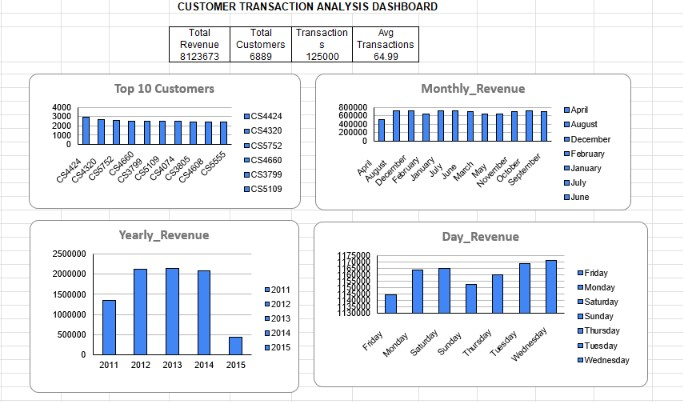

# Customer Transaction Analysis

## Project Overview

This project analyzes customer transaction data using Python, SQL, and Google Sheets to identify revenue trends, customer behavior, and business insights.

## Objectives

* Analyze customer transaction data
* Identify top customers
* Study monthly and yearly revenue trends
* Create visualizations and dashboards
* Generate business insights

## Tools Used

* Python
* Pandas
* Matplotlib
* SQL
* Google Sheets
* VS Code

## Dataset Information

* Total Transactions: 125,000
* Total Customers: 6,889
* Total Revenue: 8,123,673
* Average Transaction Amount: 64.99

## Key Insights

* Customer CS4424 generated the highest revenue.
* August recorded the highest monthly revenue.
* 2013 generated the highest yearly revenue.
* Wednesday showed the highest transaction activity.

## Dashboard

## Conclusion

The project successfully demonstrates data cleaning, exploratory data analysis, SQL querying, dashboard creation, and business insight generation.

